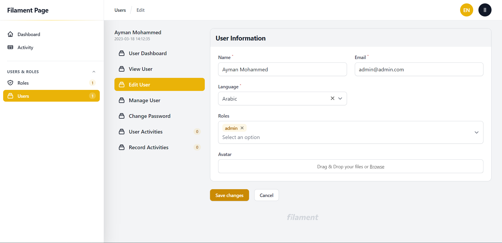
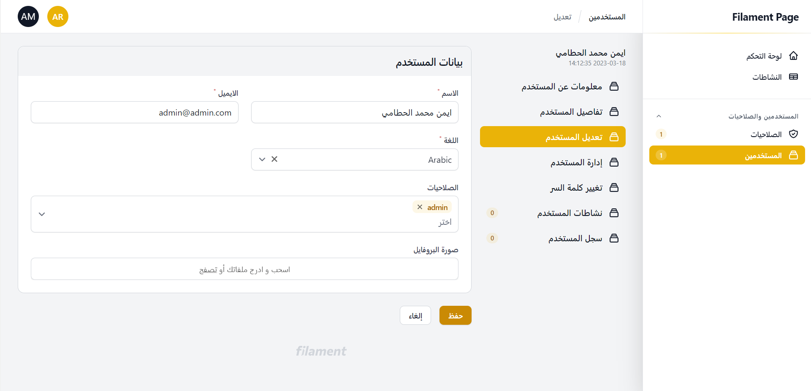

# Filament Page With Sidebar Demo Project

> **Note:**
> For Filament 2.x use [filament-v2 branch](https://github.com/aymanalhattami/filament-page-with-sidebar-project/tree/filament-v2)


Demo project for [Filament Page With Sidebar](https://github.com/aymanalhattami/filament-page-with-sidebar) package

## Screenshots




# Installation
```bash
git clone https://github.com/aymanalhattami/filament-page-with-sidebar-project.git
```

```bash
cd filament-page-with-sidebar-project
```

```bash
composer install
```

```bash
copy .env.example .env
```

Create database and prepare database connection

```bash
php artisan key:generate
```

```bash
php artisan migrate --seed
```

```bash
php artisan serve
```

```bash
email: admin@admin.com
password: password
```

Go to

http://127.0.0.1:8008/admin/users

and then click 'view' button of any user